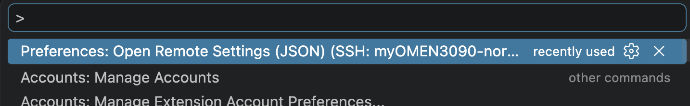
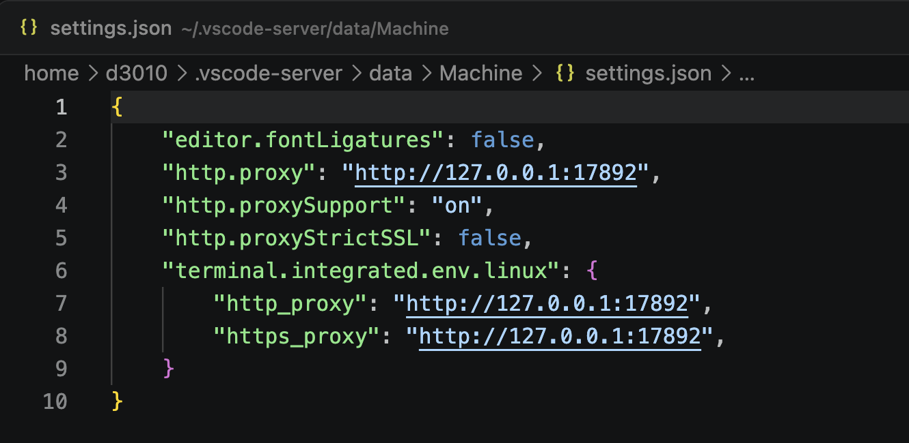

## 背景

我的 MacBook 可以正常访问 OpenAI、Google 等服务，但远端 Linux Server 不能直接访问这些网络资源。为了在远端服务器上使用 Codex、Firefox 和 VSCode Remote，可以把 MacBook 上已经可用的本地 HTTP 代理，通过 SSH `RemoteForward` 反向暴露给远端服务器。

最终效果是：

- MacBook 上的 HTTP 代理监听在 `127.0.0.1:17891`
- SSH 连接建立后，远端 Linux Server 上会出现一个本地端口 `127.0.0.1:17892`
- 远端命令行工具、Firefox、VSCode Server 都可以把 `127.0.0.1:17892` 当作 HTTP/HTTPS 代理使用
- 实际流量会通过 SSH 隧道回到 MacBook，再由 MacBook 的本地代理访问外网

整体链路如下：

```text
Linux Server app
  -> 127.0.0.1:17892
  -> SSH RemoteForward
  -> MacBook 127.0.0.1:17891
  -> MacBook VPN / Proxy
  -> OpenAI / Google / other services
```

这里用到的是 HTTP 代理，不是 SOCKS 代理。因此后续配置里都使用 `http://127.0.0.1:17892`。

## 1. 在 MacBook 上配置 SSH RemoteForward

编辑 MacBook 本机的 SSH 配置：

```bash
vim ~/.ssh/config
```

给远端服务器增加一个 Host，例如：

```sshconfig
Host myOMEN3090-codexcli
  HostName 10.177.35.72
  User d3010
  RemoteForward 17892 127.0.0.1:17891
  ExitOnForwardFailure yes
  RequestTTY yes
  RemoteCommand cd ~/code/CAD && exec $SHELL -l
```

其中最关键的是这一行：

```sshconfig
RemoteForward 17892 127.0.0.1:17891
```

它的含义是：在远端 Linux Server 上监听 `127.0.0.1:17892`，并把这个端口收到的请求转发回 MacBook 的 `127.0.0.1:17891`。

几个配置项的作用：

- `17892`：远端 Linux Server 上暴露出来的代理入口
- `127.0.0.1:17891`：MacBook 本机已经可用的 HTTP 代理
- `ExitOnForwardFailure yes`：如果端口转发失败，SSH 直接退出，避免误以为代理已经建立
- `RequestTTY yes` 和 `RemoteCommand ... exec $SHELL -l`：可选，用于登录后自动进入指定目录并启动登录 shell

然后通过这个 Host 登录服务器：

```bash
ssh myOMEN3090-codexcli
```

注意：这条 SSH 连接需要保持在线。连接断开后，远端的 `127.0.0.1:17892` 代理入口也会随之消失。

## 2. 在远端 Linux Server 上验证代理通路

登录远端服务器后，先确认端口是否已经监听：

```bash
ss -ltnp | grep 17892
```

如果看到类似输出，说明 SSH 反向转发已经建立：

```text
LISTEN 0 128 127.0.0.1:17892 0.0.0.0:*
```

再测试代理是否真的可用：

```bash
curl -I -x http://127.0.0.1:17892 https://api.openai.com
```

也可以测试 Google：

```bash
curl -I -x http://127.0.0.1:17892 https://www.google.com
```

如果返回类似下面的响应，说明远端已经可以通过 MacBook 的代理访问外网：

```http
HTTP/1.1 200 Connection established
HTTP/2 200
```

## 3. 让远端命令行和 Codex 使用代理

在当前 shell 中临时启用代理：

```bash
export http_proxy=http://127.0.0.1:17892
export https_proxy=http://127.0.0.1:17892
export HTTP_PROXY=http://127.0.0.1:17892
export HTTPS_PROXY=http://127.0.0.1:17892
```

确认环境变量已经生效：

```bash
env | grep -i proxy
```

再测试不显式传 `-x` 的普通请求：

```bash
curl -I https://api.openai.com
```

如果请求成功，说明当前 shell 下的命令已经会自动走代理。此时在同一个 shell 中启动 Codex：

```bash
codex
```

Codex 使用 device code authorization 登录时，会给出一次性设备码和登录 URL。可以用 MacBook 浏览器打开对应 URL，输入设备码并完成授权。授权完成后，远端 Linux Server 上的 Codex 就会通过这条代理链路访问 OpenAI 服务。

## 4. 可选：SSH 登录自动加载 Bash 配置，但代理手动开启

如果每次 SSH 登录后都需要手动执行：

```bash
source ~/.bashrc
```

通常是因为登录 shell 读取了 `~/.bash_profile`，但 `~/.bash_profile` 没有主动加载 `~/.bashrc`。

可以在远端服务器的 `~/.bash_profile` 中加入：

```bash
# Load interactive bash config.
if [ -f ~/.bashrc ]; then
    . ~/.bashrc
fi
```

这样 SSH 登录后会自动加载 `~/.bashrc`。但代理不建议直接在 `~/.bashrc` 里自动 `export`，否则每次登录都会默认开启代理。更稳妥的做法是把代理做成手动开关。

在远端服务器的 `~/.bashrc` 中加入：

```bash
# HTTP proxy through Mac SSH RemoteForward.
# Run `proxy_on` after SSH login when the forwarded proxy is available.
proxy_on() {
    local proxy_url="${1:-http://127.0.0.1:17892}"
    export http_proxy="$proxy_url"
    export https_proxy="$proxy_url"
    export HTTP_PROXY="$proxy_url"
    export HTTPS_PROXY="$proxy_url"
    echo "Proxy enabled: $proxy_url"
}

proxy_off() {
    unset http_proxy https_proxy HTTP_PROXY HTTPS_PROXY
    echo "Proxy disabled"
}

proxy_status() {
    if [ -n "${http_proxy:-}" ] || [ -n "${https_proxy:-}" ] || [ -n "${HTTP_PROXY:-}" ] || [ -n "${HTTPS_PROXY:-}" ]; then
        env | grep -E '^(http_proxy|https_proxy|HTTP_PROXY|HTTPS_PROXY)='
    else
        echo "Proxy is off"
    fi
}
```

之后需要代理时执行：

```bash
proxy_on
```

如果要临时使用其他代理地址：

```bash
proxy_on http://127.0.0.1:7890
```

关闭代理：

```bash
proxy_off
```

查看状态：

```bash
proxy_status
```

为了避免忘记命令，可以在 `~/.bashrc` 中加一个只针对 SSH 交互登录的提示：

```bash
if { [ -n "${SSH_CONNECTION:-}" ] || [ -n "${SSH_TTY:-}" ]; } \
    && [ -z "${http_proxy:-}" ] && [ -z "${https_proxy:-}" ] \
    && [ -z "${HTTP_PROXY:-}" ] && [ -z "${HTTPS_PROXY:-}" ]; then
    echo "Proxy is off. Run: proxy_on [url]  (default: http://127.0.0.1:17892)"
fi
```

检查 Bash 配置语法：

```bash
bash -n ~/.bash_profile
bash -n ~/.bashrc
```

这个方案把“登录时加载 Bash 配置”和“是否启用代理”拆开了：SSH 登录后自动获得 PATH、Prompt、别名和函数，但代理仍然由 `proxy_on` 手动开启。

## 5. 给远端 Firefox 配置本机代理

图形界面程序通常不会自动继承你在某个 shell 里设置的 `http_proxy` / `https_proxy`。如果远端 Firefox 需要访问 Google、OpenAI 或其他外网资源，需要在 Firefox 自己的配置里指定代理。

先确认代理通路可用：

```bash
curl -I -x http://127.0.0.1:17892 https://www.google.com
```

找到 Firefox profile 目录，例如：

```bash
~/.mozilla/firefox/ogm6qm5e.default-release-1778409088644
```

在 profile 目录下创建或修改 `user.js`：

```js
user_pref("network.proxy.type", 1);
user_pref("network.proxy.http", "127.0.0.1");
user_pref("network.proxy.http_port", 17892);
user_pref("network.proxy.ssl", "127.0.0.1");
user_pref("network.proxy.ssl_port", 17892);
user_pref("network.proxy.share_proxy_settings", true);
user_pref("signon.autologin.proxy", true);
```

然后重启 Firefox：

```bash
firefox --quit
nohup firefox -new-window about:blank >/tmp/firefox-restart.log 2>&1 &
```

这里配置的是远端 Firefox 访问远端自己的 `127.0.0.1:17892`。不要把它配置成 MacBook 的内网 IP，也不需要配置 SOCKS。

## 6. 给 VSCode Remote 配置代理

VSCode Remote 连接到服务器后，可以打开远端 settings JSON：

```text
Preferences: Open Remote Settings (JSON)
```



对应文件通常位于远端服务器：

```text
~/.vscode-server/data/Machine/settings.json
```

写入或合并以下配置：

```json
{
  "http.proxy": "http://127.0.0.1:17892",
  "http.proxySupport": "on",
  "http.proxyStrictSSL": false,
  "terminal.integrated.env.linux": {
    "http_proxy": "http://127.0.0.1:17892",
    "https_proxy": "http://127.0.0.1:17892"
  }
}
```



这些配置分别影响：

- `http.proxy`：VSCode Server、扩展下载、扩展网络请求使用的代理
- `http.proxySupport`：开启 VSCode 的代理支持
- `http.proxyStrictSSL`：在部分代理或中转环境下放宽 SSL 校验
- `terminal.integrated.env.linux`：让 VSCode 集成终端自动带上代理环境变量

配置完成后，建议重新连接 VSCode Remote，或者执行一次 Reload Window，让 VSCode Server 和扩展重新读取配置。

## 总结

SSH `RemoteForward` 很适合解决“本机 MacBook 能访问外网，但远端 Linux Server 不能访问”的问题。核心配置只有一行：

```sshconfig
RemoteForward 17892 127.0.0.1:17891
```

它把远端服务器的 `127.0.0.1:17892` 接到了 MacBook 的本地 HTTP 代理 `127.0.0.1:17891`。在这个基础上：

- Codex 和命令行工具通过 `http_proxy` / `https_proxy` 使用代理
- Bash 配置通过 `proxy_on` / `proxy_off` 保持手动可控
- Firefox 在 profile 的 `user.js` 中配置 HTTP/HTTPS 代理
- VSCode Remote 在远端 settings JSON 中配置 `http.proxy` 和集成终端环境变量

配置完成后，只要 SSH 会话保持在线，远端服务器上的命令行、浏览器和开发工具都可以复用 MacBook 的网络能力。
